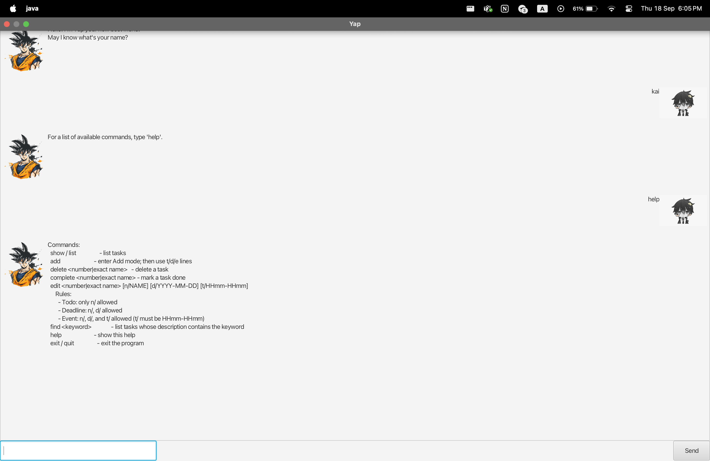

# Yap

> “Productivity is never an accident. It is always the result of a commitment to excellence.” – Paul J. Meyer

Welcome to **Yap Task Manager** — Yap helps you **organise** and *track* your tasks with ease. It’s:

- Text-based and GUI-enabled
- Simple to use
- ~~boring~~ **fun** to try
- Lightning fast ⚡

---

## Getting Started

### Installation

1. Ensure you have **Java 17 or above** installed.
2. Clone or download the project from [here](https://github.com/kahei9299/ip).
3. Build it with Gradle:
   ```bash
   ./gradlew shadowJar
   ```
   The jar file will be created at `build/libs/duke.jar`.

### Running the App

```bash
java -jar build/libs/duke.jar
```

On startup, Yap will display a welcome message in both the CLI and the GUI.

---

## Features

Below are the primary commands you can use in **Yap**, with format and examples.

> **Notation**:
> - `UPPER_CASE` are user-supplied values.
> - `[OPTIONAL]` values are optional.
> - Times use 24-hour format `HHmm`.
> - For `event`, `/from … /to …` must be a valid time range.

| Command | Format | Description | Examples |
|---|---|---|---|
| **Add To-do** | `todo DESCRIPTION` | Adds a simple task without date/time. | `todo Read book` |
| **Add Deadline** | `deadline DESCRIPTION /by DATE [TIME]` | Adds a task due by a date (optional time). | `deadline Submit report /by 2025-09-30 2359` |
| **Add Event** | `event DESCRIPTION /from DATE TIME /to DATE TIME` | Adds an event with start and end time. | `event Meeting /from 2025-10-02 1400 /to 2025-10-02 1600` |
| **List** | `list` | Displays all tasks. | `list` |
| **Mark / Unmark** | `mark INDEX` / `unmark INDEX` | Marks or unmarks a task. | `mark 2` |
| **Edit** | `edit INDEX /name NEW_NAME` <br> `edit INDEX /time /from DATE TIME /to DATE TIME` | Updates task name or time. | `edit 3 /name Final report` |
| **Delete** | `delete INDEX` | Deletes a task by index. | `delete 5` |
| **Find** | `find KEYWORD [MORE_KEYWORDS]` | Finds tasks matching keywords. | `find book` |
| **Help** | `help` | Displays available commands. | `help` |

---

## Date & Time Formats

- **Date**: `YYYY-MM-DD` (e.g., `2025-09-19`)
- **Time**: `HHmm` 24-hour format (e.g., `0930`, `2359`)
- **Events**: `/from` must be earlier than `/to`.
  ```
  event Tutorial /from 2025-09-20 1000 /to 2025-09-20 1200
  ```

---

## Example Usage

```java
public class Main {
    public static void main(String[] args) {
        new Yap("data/tasks.txt").run();
    }
}
```

---

## Graphical User Interface

Here’s the full GUI of the application:



- **Task List Panel**: Displays tasks and their statuses.
- **Command Input**: Type commands at the bottom.
- **Error Messages**: Appear at the top when inputs are invalid.

---

## Troubleshooting

- **Error: “Description cannot be empty.”** → Add a description after `todo`, `deadline`, or `event`.
- **Error: “Invalid time range.”** → Ensure `/to` is later than `/from`.
- **Error: “Unrecognized command.”** → Use `help` to see the command list.

---

## Quick Reference

```
todo DESCRIPTION
deadline DESCRIPTION /by DATE [TIME]
event DESCRIPTION /from DATE TIME /to DATE TIME
list
mark INDEX
unmark INDEX
edit INDEX /name NEW_NAME
edit INDEX /time /from DATE TIME /to DATE TIME
delete INDEX
find KEYWORD [MORE_KEYWORDS]
help
```

---

## Coming Soon

- [ ] Reminders
- [ ] Notifications
- [x] Add tasks
- [x] Delete tasks

---

